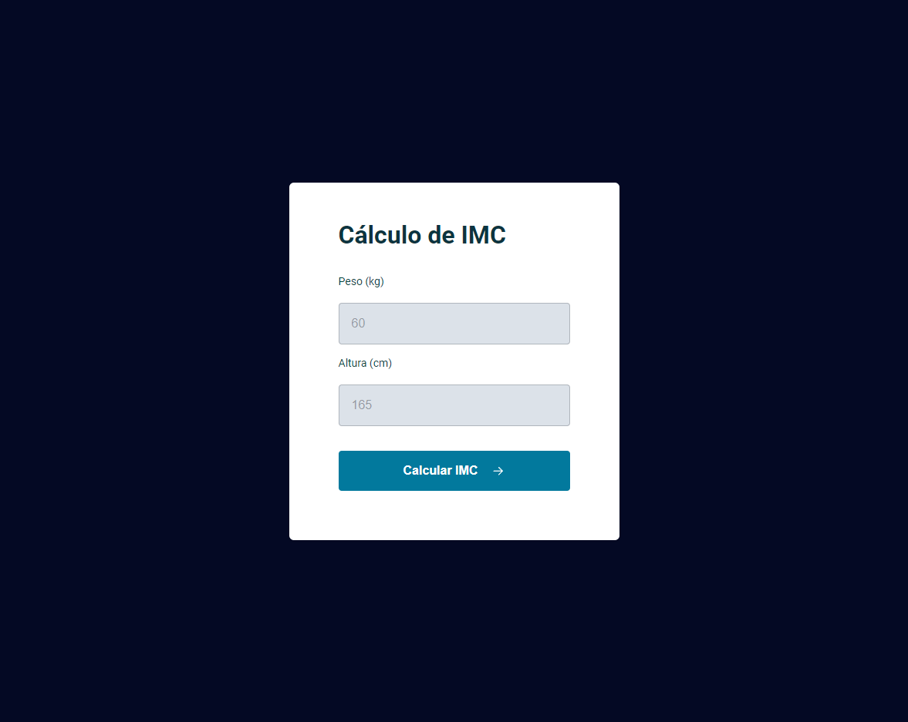

# Preview do projeto Calculadora de IMC

## Calculo IMC - Stage 05.
  Esse projeto realiza calculo de IMC(Índice de massa corporal) e mostra resultado na tela
  
## O que foi aprendido?
     Nesse projeto foi praticado seguinte conceitos:
      -ES6 MODULES;
      -ESTRUTURAÇÃO DADOS DO MODAL;
      -VALIDAÇÃO DADOS;
      -FUNÇÃO;
      -FUNÇÃO CALLBACK;
      -REFATORAÇÃO;
      -MANIPULAÇÃO DOM;
      -DIPLAY GRID;
      -IF ELSE;

## Tecnologies
    - HTML;
    - CSS;
    - JAVASCRIPT;

## Contato
E-mail: e.rickilopova@hotmail.com
